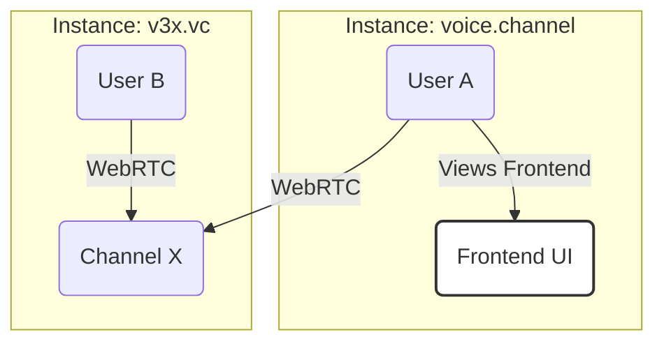

# Project Guide: Voice Channel

This document provides a comprehensive overview of the Voice Channel project, its architecture, and its core concepts. It is written as if the project is complete to guide development.

## 1. Overview

Voice Channel is a federated, open-source application for voice, video, and text communication. It's designed to be simple, reliable, and scalable, allowing communities to host their own instances while being able to communicate with others.

## 2. Core Concepts

### Instances & Federation

The system is built on a network of independent **Instances**.

-   **Instance**: A self-hosted deployment of the server, identified by its unique Fully Qualified Domain Name (FQDN), e.g., `voice.channel`, `v3x.vc`. Each instance manages its own users, groups, and channels.
-   **Federation**: Instances can communicate with each other. Users on one instance can join channels on another instance seamlessly. Media traffic is always routed directly through the channel's host instance for optimal performance.



### Groups & Channels

-   **Group**: A collection of channels within an instance, e.g., `gaming`, `development`. The group name must be unique within an instance.
-   **Channel**: A space for communication within a group. It includes a persistent text chat and an optional voice/video call "room".

### Channel Membership vs. Voice Calls (UX)

This is a key distinction for user experience:

| Concept                | Description                                                                  | Action Required        |
| ---------------------- | ---------------------------------------------------------------------------- | ---------------------- |
| **Channel Membership** | Subscribing to a channel. This adds it to your sidebar for text chat access. | "Join Channel"         |
| **Voice Call**         | Actively participating in the real-time voice/video call within a channel.   | "Join Call" (explicit) |

The default view for a channel is the text chat. Users must explicitly join the voice call.

## 3. Architecture

### Technology Stack

| Area       | Technology                                                                       |
| ---------- | -------------------------------------------------------------------------------- |
| **Server** | Rust, Poem, `poem_openapi`, SQLx, PostgreSQL, Redis, Mediasoup                   |
| **Web**    | PNPM, React, TypeScript, Vite, Tailwind CSS, Radix UI, TanStack (Router & Query) |
| **API**    | `openapi-typescript` and `openapi-hooks` for frontend/backend integration        |

### Service & API Structure

-   **API Endpoints**: All API routes are prefixed with `/api`.
-   **OpenAPI Spec**: The schema is exposed at `/openapi.json`.
-   **API Docs**: Interactive Scalar documentation is available at `/docs`.

### Multi-Worker Scaling

Instances can be scaled horizontally by running multiple worker processes.

-   **API Workers**: Handle HTTP requests, signaling, and coordination.
-   **Media Workers**: Handle CPU-intensive WebRTC media routing using Mediasoup.
-   Workers within the same instance authenticate with a shared secret key.

## 4. User & Access Management

### Authentication

-   **Authentication Method**: The only supported method is passwordless authentication using **Passkeys** with **Resident Keys (Discoverable Credentials)**.
-   **Why Resident Keys?**: This requirement ensures the highest level of security and provides a seamless, "username-less" login experience. Users authenticate directly with their device, as the key itself contains their identifier.

### Account Creation & Onboarding

1.  **Bootstrapping**: When an instance is new (zero users in the database), the first person to sign up is automatically granted administrator privileges. This user can then configure the instance.
2.  **Registration**: New user registration can be configured instance-wide:
    -   **Invite-Only**: Users must have a unique invite link (`/invite/:code`) to create an account.
    -   **Open**: Anyone can create an account.

### Instance Data Model

Each instance maintains its own persistent data:

- **Users** – WebAuthn credentials (resident keys), profile data, and permissions.
- **Groups** – Top-level namespaces that organize channels.
- **Channels** – Contain message history, voice-call metadata, and settings.
- **Memberships** – Relationships linking users to channels (read status, roles, etc.).

There is **no shared global database**—federation happens through API calls between instances.

### Admin Bootstrapping (Zero-User Setup)

When the database is empty the server automatically exposes a **Setup Wizard** at `/setup`:

1. Create the first account via resident-key registration.
2. Assign the new user `admin` role.
3. Allow the admin to review and change default instance settings (registration mode, federation keys, etc.).

After completion, `/setup` is disabled until the database is emptied again.

## 5. URL Structure

The URL scheme is designed for seamless local and federated channel access.

| Scope             | URL Example                                 | Description                                                                  |
| ----------------- | ------------------------------------------- | ---------------------------------------------------------------------------- |
| **Local**         | `https://voice.channel/dev/rust`            | Accesses the `rust` channel in the `dev` group on the current instance.      |
| **Local (Admin)** | `https://voice.channel/general`             | The group name (`admin`) can be omitted for the default admin group.         |
| **Federated**     | `https://voice.channel/v3x.vc/gaming/retro` | Accesses the `retro` channel in the `gaming` group on the `v3x.vc` instance. |

## 6. Reserved URLs

-   `/settings`: User profile and application settings.
-   `/admin`: Instance administration panel for users with admin permissions.

## Frontend Architecture

### Overview
The frontend uses a modern React architecture with TanStack Router, TanStack Query, and a token-based authentication system. All server state is managed declaratively through React Query hooks.

### Authentication Architecture

#### Token Management
- **Location**: `packages/web/src/services/api.ts`
- **System**: localStorage-based token storage with automatic header injection
- **Current**: Uses `user_id` as token (backend compatible)
- **Future**: Ready for JWT integration

```typescript
// Token is automatically injected into all API calls
const response = await apiFetch('/users/{user_id}', 'get', {
  path: { user_id: userId }
});
```

#### Authentication Context
- **Location**: `packages/web/src/contexts/AuthContext.tsx`
- **Purpose**: Centralized auth state management
- **Usage**: Wrap app with `<AuthProvider>` in main.tsx

```typescript
const { isAuthenticated, token, login, logout } = useAuthContext();
```

### Data Fetching Patterns

#### Query Architecture
All authenticated data uses the `['auth']` query key prefix:

```typescript
// User data
['auth', 'user', userId]

// User's channels
['auth', 'user', userId, 'channels']

// Channel-specific data
['auth', 'channel', instanceFqdn, channelName]
```

#### Custom Hooks Pattern

##### Authentication Hook
```typescript
const { 
  isAuthenticated,
  login,
  register, 
  logout,
  isLoggingIn,
  isRegistering 
} = useAuth();
```

##### User Data Hook
```typescript
const { 
  user, 
  isLoading, 
  updateUser, 
  isUpdatingUser 
} = useUser();
```

##### Channels Hook
```typescript
const { 
  channels, 
  isLoading, 
  joinChannel, 
  leaveChannel 
} = useChannels();
```

### Component Patterns

#### Declarative Data Access
❌ **Don't** use useEffect/useState for server data:
```typescript
// BAD
const [user, setUser] = useState(null);
useEffect(() => {
  fetch('/api/user').then(res => setUser(res.data));
}, []);
```

✅ **Do** use custom hooks:
```typescript
// GOOD
const { user, isLoading } = useUser();
```

#### Loading States
All hooks provide loading states automatically:
```typescript
const { user, isLoading, error } = useUser();

if (isLoading) return <Spinner />;
if (error) return <ErrorMessage error={error} />;
return <UserProfile user={user} />;
```

#### Mutations
Use mutations for all data changes:
```typescript
const { updateUser, isUpdatingUser } = useUser();

const handleSave = () => {
  updateUser({ display_name: newName });
};
```

### API Integration

#### OpenAPI Integration
- **Types**: Auto-generated from backend OpenAPI schema
- **Location**: `packages/web/src/types/api.ts`
- **Usage**: Import types from `../services/auth` or `../services/api`

```typescript
import type { User, ChannelMembership } from '../services/auth';
```

#### Authenticated Requests
All API calls automatically include authentication:
```typescript
// Token is injected automatically
const response = await apiFetch('/protected-endpoint', 'get', {});
```

#### Error Handling
- 401 responses automatically clear auth state
- Network errors are handled by TanStack Query
- Component-level error boundaries catch React errors

### State Management Principles

#### 1. Server State vs Client State
- **Server State**: Use TanStack Query (user data, channels, etc.)
- **Client State**: Use useState/useReducer (form inputs, UI state)

#### 2. Cache Invalidation
Auth state changes automatically invalidate related queries:
```typescript
// Login automatically invalidates all ['auth'] queries
contextLogin(userId);
queryClient.invalidateQueries({ queryKey: ['auth'] });
```

#### 3. Optimistic Updates
For better UX, implement optimistic updates:
```typescript
const mutation = useMutation({
  mutationFn: updateUser,
  onMutate: async (newData) => {
    // Cancel outgoing refetches
    await queryClient.cancelQueries({ queryKey: ['auth', 'user', userId] });
    
    // Snapshot previous value
    const previousUser = queryClient.getQueryData(['auth', 'user', userId]);
    
    // Optimistically update
    queryClient.setQueryData(['auth', 'user', userId], newData);
    
    return { previousUser };
  },
  onError: (err, newData, context) => {
    // Rollback on error
    queryClient.setQueryData(['auth', 'user', userId], context.previousUser);
  }
});
```

### WebAuthn Integration

#### AuthService
- **Location**: `packages/web/src/services/auth.ts`
- **Purpose**: WebAuthn credential operations only
- **Usage**: Used internally by auth hooks

```typescript
// Don't use AuthService directly in components
// Use useAuth hook instead
const { login, register } = useAuth();
```

#### Passkey Flow
1. User clicks login/register
2. WebAuthn challenge requested from server
3. Browser handles passkey creation/authentication
4. Server validates and returns user_id
5. Frontend stores user_id as token
6. All subsequent requests include token

### Routing Integration

#### TanStack Router
- **Config**: `packages/web/src/routeTree.gen.ts` (auto-generated)
- **Routes**: Define in `packages/web/src/routes/`

#### Protected Routes
Use route-level authentication:
```typescript
// In route definition
beforeLoad: ({ context }) => {
  if (!context.auth.isAuthenticated) {
    throw redirect({ to: '/login' });
  }
}
```

### Development Patterns

#### Adding New Authenticated Endpoints

1. **Define Query Options**:
```typescript
const getChannelMessages = (channelId: string) => queryOptions({
  queryKey: ['auth', 'channel', channelId, 'messages'],
  queryFn: async () => {
    const response = await apiFetch('/channels/{id}/messages', 'get', {
      path: { id: channelId }
    });
    return response.data;
  }
});
```

2. **Create Custom Hook**:
```typescript
export const useChannelMessages = (channelId: string) => {
  const { isAuthenticated } = useAuthContext();
  
  return useQuery({
    ...getChannelMessages(channelId),
    enabled: isAuthenticated && !!channelId
  });
};
```

3. **Use in Components**:
```typescript
const { messages, isLoading } = useChannelMessages(channelId);
```

#### Adding Mutations

1. **Define Mutation**:
```typescript
const sendMessage = useMutation({
  mutationFn: async (data: { channelId: string; content: string }) => {
    return apiFetch('/channels/{id}/messages', 'post', {
      path: { id: data.channelId },
      data: { content: data.content }
    });
  },
  onSuccess: () => {
    // Invalidate messages query
    queryClient.invalidateQueries({ 
      queryKey: ['auth', 'channel', channelId, 'messages'] 
    });
  }
});
```

2. **Use in Components**:
```typescript
const { mutate: sendMessage, isPending } = useSendMessage();
```

### Best Practices

#### 1. Hook Naming
- `use{Entity}` for data fetching (useUser, useChannels)
- `use{Action}` for mutations (useSendMessage, useUpdateProfile)

#### 2. Query Keys
- Always use arrays for query keys
- Include all dependencies in the key
- Use consistent naming patterns

#### 3. Error Handling
- Let TanStack Query handle retries
- Show user-friendly error messages
- Use error boundaries for unexpected errors

#### 4. Loading States
- Always handle loading states in UI
- Use skeleton loaders for better UX
- Avoid multiple loading spinners

#### 5. Type Safety
- Use OpenAPI generated types
- Avoid `any` types
- Validate data at boundaries

### Testing Patterns

#### Mock API Calls
```typescript
// Mock apiFetch for testing
jest.mock('../services/api', () => ({
  apiFetch: jest.fn()
}));
```

#### Test Hooks
```typescript
import { renderHook } from '@testing-library/react';
import { QueryClient, QueryClientProvider } from '@tanstack/react-query';

const createWrapper = () => {
  const queryClient = new QueryClient();
  return ({ children }) => (
    <QueryClientProvider client={queryClient}>
      {children}
    </QueryClientProvider>
  );
};

test('useUser returns user data', () => {
  const { result } = renderHook(() => useUser(), {
    wrapper: createWrapper()
  });
  
  expect(result.current.isLoading).toBe(true);
});
```

### Migration Guide

#### From Old Pattern to New Pattern

❌ **Old**: Direct authService usage
```typescript
const [user, setUser] = useState(null);
useEffect(() => {
  const currentUser = authService.getCurrentUser();
  setUser(currentUser);
}, []);
```

✅ **New**: Hook-based approach
```typescript
const { user, isLoading } = useUser();
```

❌ **Old**: Manual fetch calls
```typescript
const [channels, setChannels] = useState([]);
useEffect(() => {
  authService.getUserChannels().then(setChannels);
}, []);
```

✅ **New**: Declarative queries
```typescript
const { channels, isLoading } = useChannels();
```
