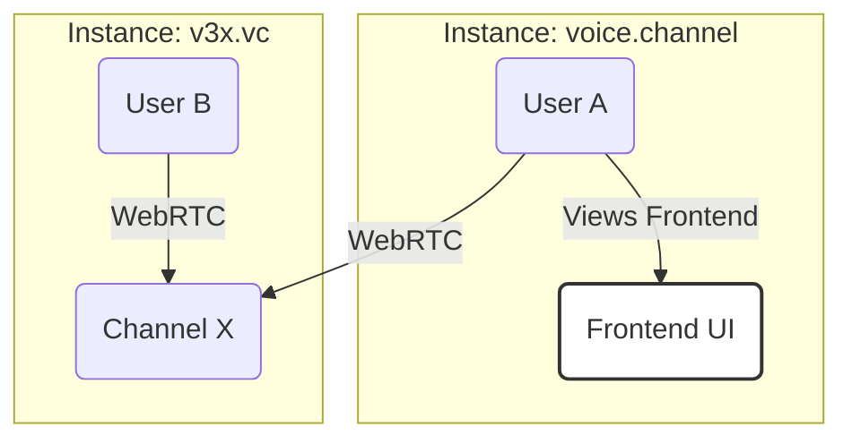

# Project Guide: Voice Channel

This document provides a comprehensive overview of the Voice Channel project, its architecture, and its core concepts. It is written as if the project is complete to guide development.

## 1. Overview

Voice Channel is a federated, open-source application for voice, video, and text communication. It's designed to be simple, reliable, and scalable, allowing communities to host their own instances while being able to communicate with others.

## 2. Core Concepts

### Instances & Federation

The system is built on a network of independent **Instances**.

-   **Instance**: A self-hosted deployment of the server, identified by its unique Fully Qualified Domain Name (FQDN), e.g., `voice.channel`, `v3x.vc`. Each instance manages its own users, groups, and channels.
-   **Federation**: Instances can communicate with each other. Users on one instance can join channels on another instance seamlessly. Media traffic is always routed directly through the channel's host instance for optimal performance.

### Groups & Channels

-   **Group**: A collection of channels within an instance, e.g., `gaming`, `development`. The group name must be unique within an instance.
-   **Channel**: A space for communication within a group. It includes a persistent text chat and an optional voice/video call "room".

### Channel Membership vs. Voice Calls (UX)

This is a key distinction for user experience:

| Concept                 | Description                                                                 | Action Required      |
| ----------------------- | --------------------------------------------------------------------------- | -------------------- |
| **Channel Membership**  | Subscribing to a channel. This adds it to your sidebar for text chat access. | "Join Channel"       |
| **Voice Call**          | Actively participating in the real-time voice/video call within a channel.  | "Join Call" (explicit) |

The default view for a channel is the text chat. Users must explicitly join the voice call.

## 3. Architecture

### Technology Stack

| Area      | Technology                                                                          |
| --------- | ----------------------------------------------------------------------------------- |
| **Server**| Rust, Poem, `poem_openapi`, SQLx, PostgreSQL, Redis, Mediasoup                       |
| **Web**   | PNPM, React, TypeScript, Vite, Tailwind CSS, Radix UI, TanStack (Router & Query) |
| **API**   | `openapi-typescript` and `openapi-hooks` for frontend/backend integration        |

### Service & API Structure

-   **API Endpoints**: All API routes are prefixed with `/api`.
-   **OpenAPI Spec**: The schema is exposed at `/openapi.json`.
-   **API Docs**: Interactive Scalar documentation is available at `/docs`.

### Multi-Worker Scaling

Instances can be scaled horizontally by running multiple worker processes.

-   **API Workers**: Handle HTTP requests, signaling, and coordination.
-   **Media Workers**: Handle CPU-intensive WebRTC media routing using Mediasoup.
-   Workers within the same instance authenticate with a shared secret key.

## 4. User & Access Management

### Authentication

-   **Authentication Method**: The only supported method is passwordless authentication using **Passkeys** with **Resident Keys (Discoverable Credentials)**.
-   **Why Resident Keys?**: This requirement ensures the highest level of security and provides a seamless, "username-less" login experience. Users authenticate directly with their device, as the key itself contains their identifier.

### Account Creation & Onboarding

1.  **Bootstrapping**: When an instance is new (zero users in the database), the first person to sign up is automatically granted administrator privileges. This user can then configure the instance.
2.  **Registration**: New user registration can be configured instance-wide:
    -   **Invite-Only**: Users must have a unique invite link (`/invite/:code`) to create an account.
    -   **Open**: Anyone can create an account.

### Instance Data Model

Each instance maintains its own persistent data:

- **Users** – WebAuthn credentials (resident keys), profile data, and permissions.
- **Groups** – Top-level namespaces that organize channels.
- **Channels** – Contain message history, voice-call metadata, and settings.
- **Memberships** – Relationships linking users to channels (read status, roles, etc.).

There is **no shared global database**—federation happens through API calls between instances.

### Admin Bootstrapping (Zero-User Setup)

When the database is empty the server automatically exposes a **Setup Wizard** at `/setup`:

1. Create the first account via resident-key registration.
2. Assign the new user `admin` role.
3. Allow the admin to review and change default instance settings (registration mode, federation keys, etc.).

After completion, `/setup` is disabled until the database is emptied again.

## 5. URL Structure

The URL scheme is designed for seamless local and federated channel access.

| Scope             | URL Example                                     | Description                                               |
| ----------------- | ----------------------------------------------- | --------------------------------------------------------- |
| **Local**         | `https://voice.channel/dev/rust`                | Accesses the `rust` channel in the `dev` group on the current instance. |
| **Local (Admin)** | `https://voice.channel/general`                 | The group name (`admin`) can be omitted for the default admin group. |
| **Federated**     | `https://voice.channel/v3x.vc/gaming/retro`     | Accesses the `retro` channel in the `gaming` group on the `v3x.vc` instance. |

## 6. Reserved URLs

-   `/settings`: User profile and application settings.
-   `/admin`: Instance administration panel for users with admin permissions. 